## **Backend-Assignment-2**

## **Objective**
- Set up user authentication with JWT.
- Create user registration and login endpoints.
- Protect routes with authentication middleware.

## **Instructions**
## **Part 1: Set Up User Authentication**
- [x] Install Additional Dependencies:
- [x] Create the User Model

## **Part 2: Implement Registration and Login Endpoints**
- [x] Set Up the Routes
- [x] Create Authentication Middleware
- [x] Integrate the Routes with the Server

## **Part 3: Test the API**
- Start Your Server (npm run dev)
- Test with Thunder Client or Postman:
- [x] Register a User: Method: POST

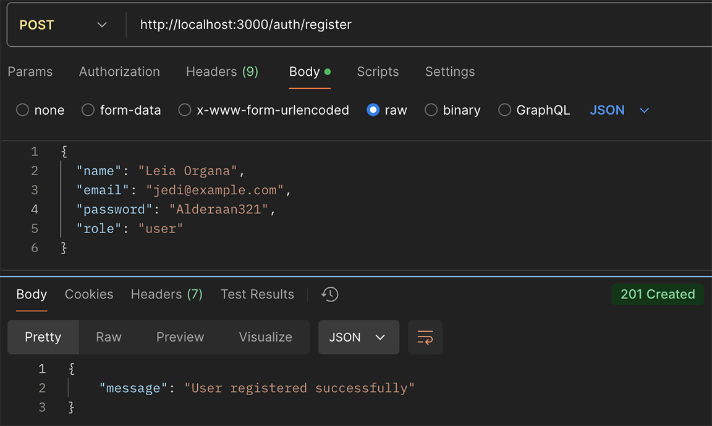

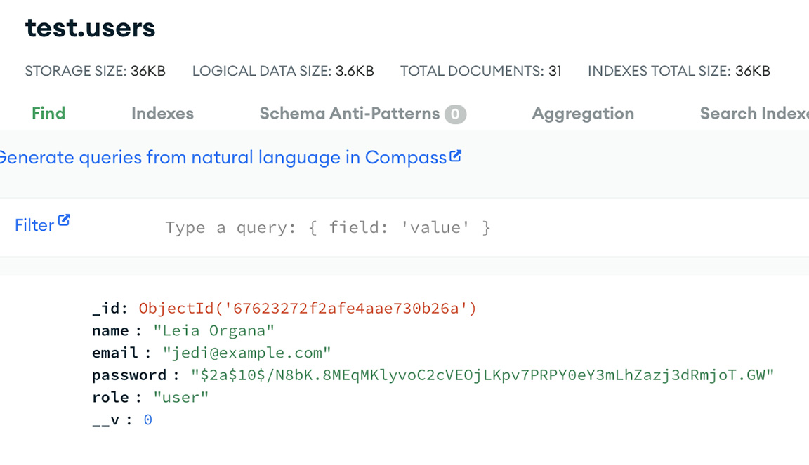

- [x] Login a User & Copy the token from the response

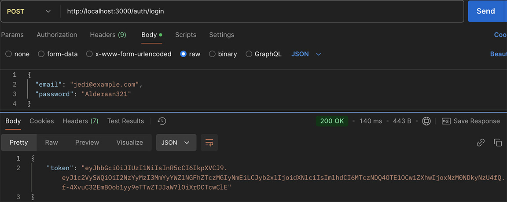

- [x] Access Protected Product Routes: Method: GET
- [x] Screenshot the GET request and response.

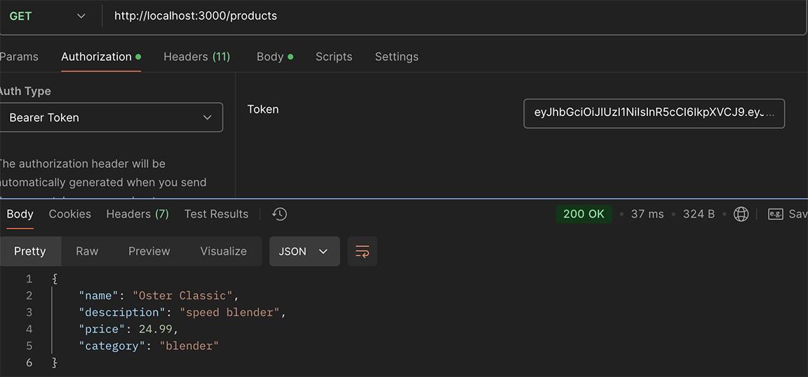

## **Backend-Assignment-3 / Weds Dec 18**

## **Objective**

- Add more endpoints to the API
- Implement CRUD operations for users
- Refine product endpoints
- Handle errors and edge cases

- [x] Step 1: Add More Endpoints to the API
- [x] Step 2: Refine Product Endpoints
- [x] Step 3: Handle Errors and Edge Cases

- Create Error Handling Middleware
- Integrate Error Handling Middleware with the Server

- [x] Step 4: Test the API

## **Test with Thunder Client or Postman**
- [x] Get All Users (Admin Only) - Method: GET

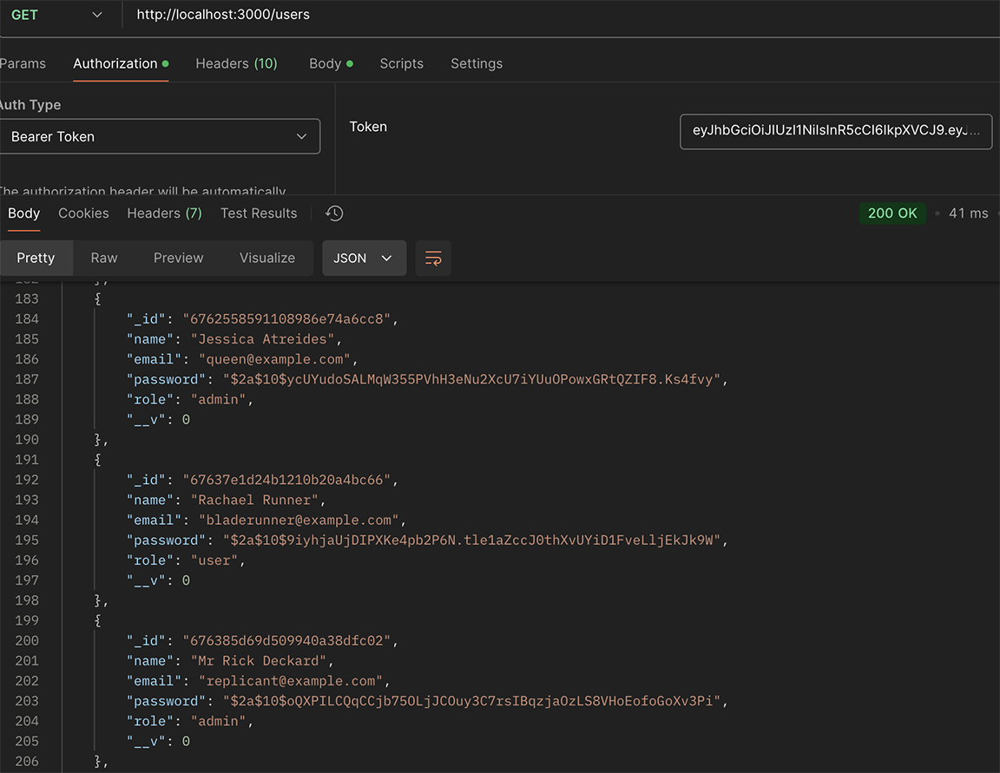

- [x] Get a Single User by ID - Method: GET

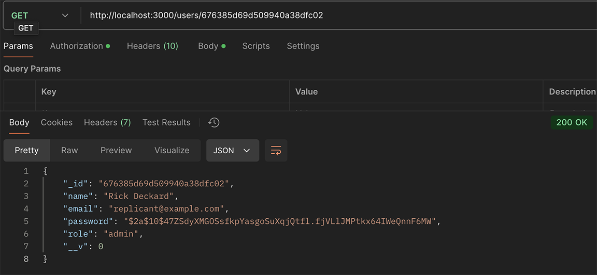

- [x] Update a User by ID: - Method: PUT

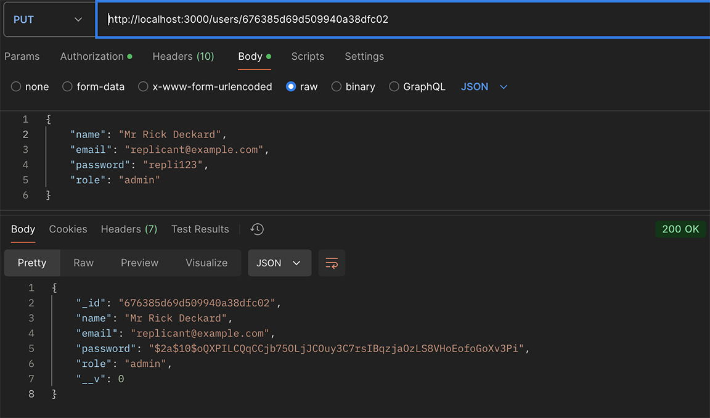

- [x] Delete a User by ID (Admin Only): Method: DELETE

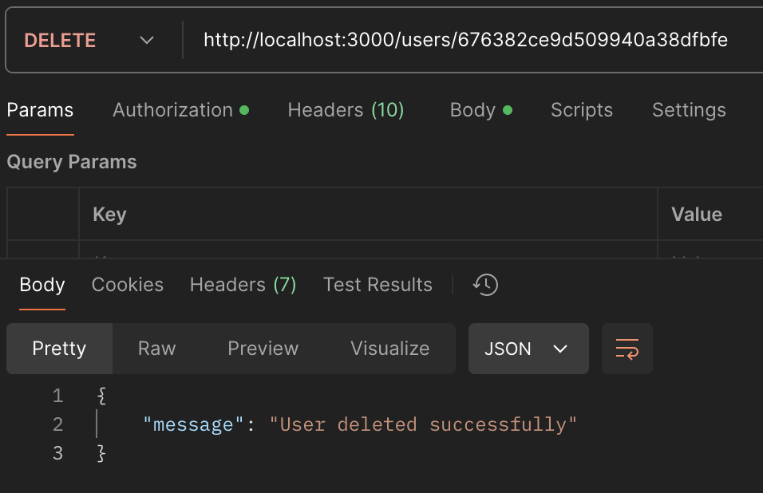

## **POST GET PUT & DELETE Products**
- [x] Post New Product with "Added Successfully Message

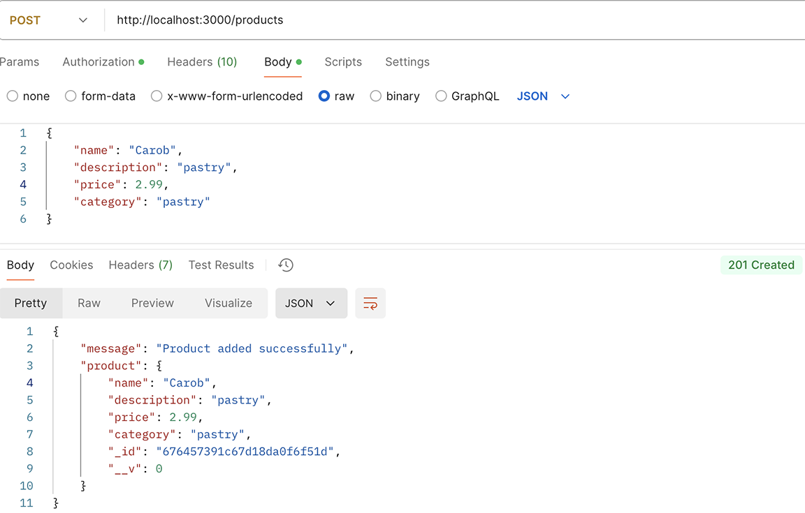

- [x] Get All Products or Filter by Category: Method: GET

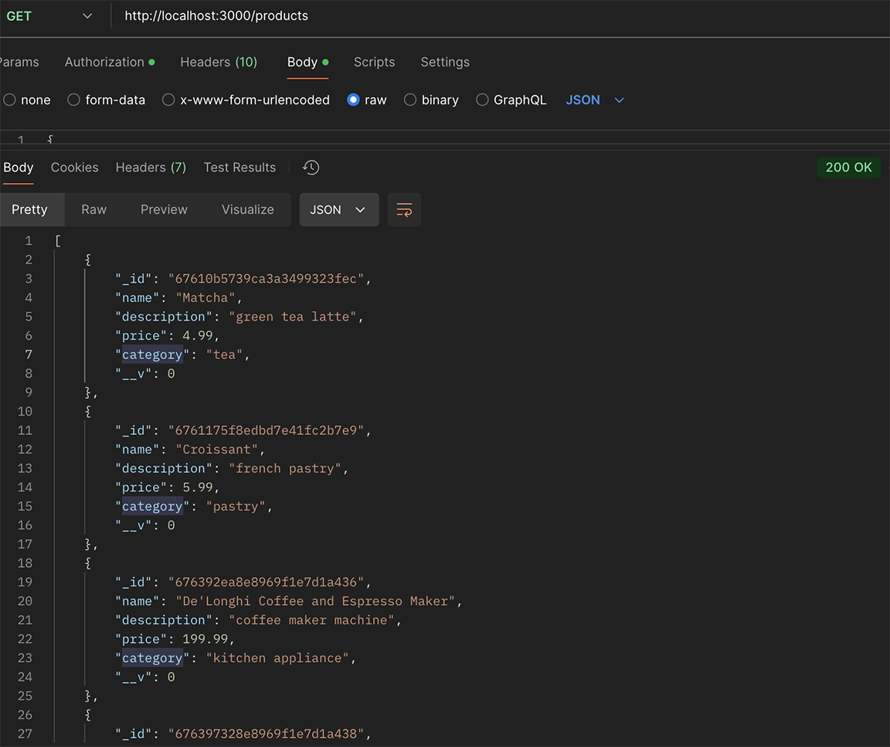

- [x] Get a Single Product by ID: Method: GET & update product price Method: PUT

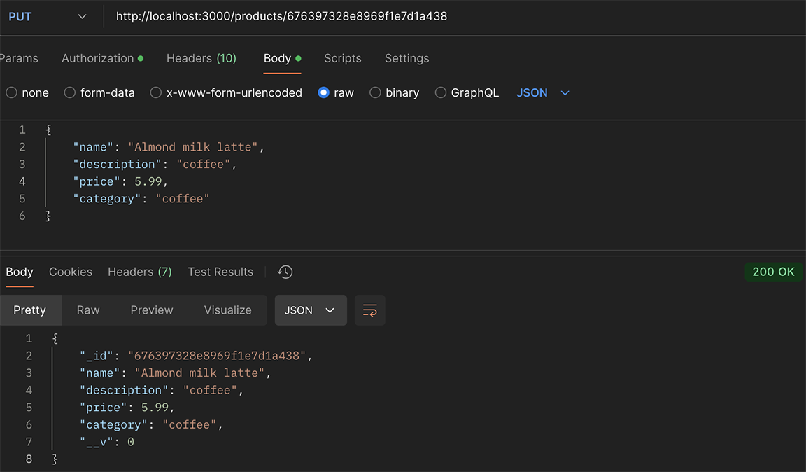

- [x] Delete a Product by ID: Method: DELETE

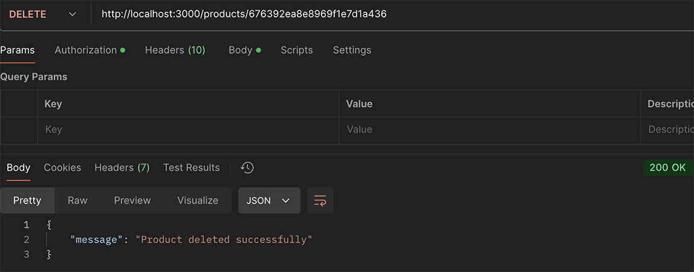

