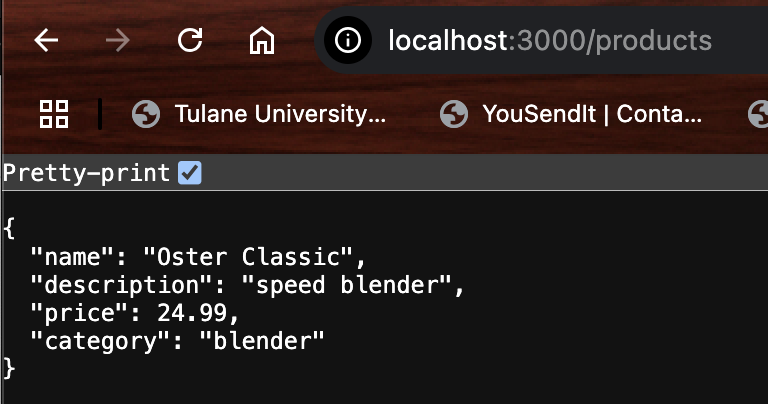

## **Backend-Assignment-2**

## **Objective**
- Set up user authentication with JWT.
- Create user registration and login endpoints.
- Protect routes with authentication middleware.

## **Instructions**
## **Part 1: Set Up User Authentication**
- [x] Install Additional Dependencies:
- [x] Create the User Model

## **Part 2: Implement Registration and Login Endpoints**
- [x] Set Up the Routes
- [x] Create Authentication Middleware
- [x] Integrate the Routes with the Server

## **Part 3: Test the API**
- Start Your Server (npm run dev)
- Test with Thunder Client or Postman:
- [x] Register a User: Method: POST

- [x] Login a User & Copy the token from the response

- [x] Access Protected Product Routes: Method: GET
- [x] Screenshot the GET request and response.

